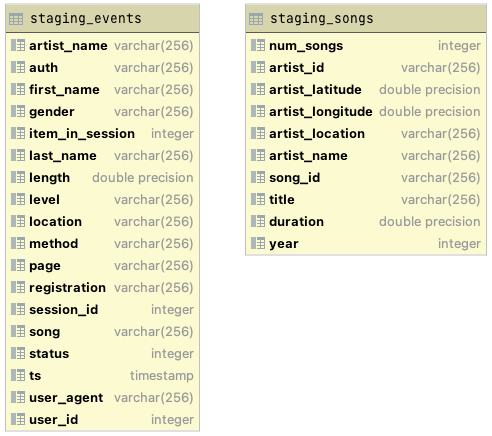
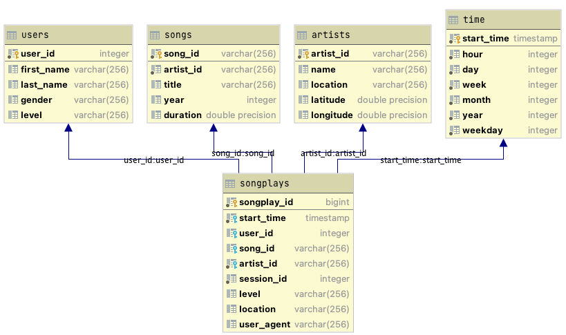

# Data Warehousing with Redshift

## Introduction

A music streaming startup, Sparkify, has grown their user base and song database and want to move their processes and
data onto the cloud. Their data resides in public S3 buckets, in a directory of JSON logs on user activity on the app,
as well as a directory with JSON metadata on the songs in their app

- ```LOG_DATA```: s3://udacity-dend/log_data
- ```LOG_JSONPATH```: s3://udacity-dend/log_json_path.json
- ```SONG_DATA```: s3://udacity-dend/song_data

The objective is to build an ETL pipeline that extracts their data from S3, stages them in Redshift, and transforms data
into a set of dimensional tables for their analytics team to continue finding insights in what songs their users are
listening to.

## Data Sources

There are two JSON sources to retrieve the data from.

**song_data**: JSON files containing song metadata. An sample entry in the JSON file is:

```JSON
{
  "num_songs": 1,
  "artist_id": "ARJIE2Y1187B994AB7",
  "artist_latitude": null,
  "artist_longitude": null,
  "artist_location": "",
  "artist_name": "Line Renaud",
  "song_id": "SOUPIRU12A6D4FA1E1",
  "title": "Der Kleine Dompfaff",
  "duration": 152.92036,
  "year": 0
}

```

**log_data**: JSON files containing song metadata. An sample entry in the JSON file is:

```JSON
{
  "artist": "Sydney Youngblood",
  "auth": "Logged In",
  "firstName": "Jacob",
  "gender": "M",
  "itemInSession": 53,
  "lastName": "Klein",
  "length": 238.07955,
  "level": "paid",
  "location": "Tampa-St. Petersburg-Clearwater, FL",
  "method": "PUT",
  "page": "NextSong",
  "registration": 1.540558e+12,
  "sessionId": 954,
  "song": "Ain't No Sunshine",
  "status": 200,
  "ts": 1543449657796,
  "userAgent": "Mozilla/5.0 (Macintosh; Intel Mac OS X 10_9_4)",
  "userId": 73
}
```

## Database Design

Using the song and log datasets, a star schema was implemented optimized for queries on song play analysis. This
includes the following tables:

### Staging tables



### Star Schema



## Prerequisites

An AWS Redshift cluster must be available with the following features:

- Create/Drop/Insert/Update permissions.
- An associated AWS IAM Role with at least `AmazonS3ReadOnlyAccess` permissions.
- An associated AWS Security group to connect to teh cluster through a TCP connection.

## Running the ETL

1. Create the file `dwh.cfg` in the prject root ewith the following information:

```yaml
[ CLUSTER ]
HOST=<cluster endpoint>
DB_NAME=<db name>
DB_USER=<db user>
DB_PASSWORD=<db password>
DB_PORT=5439

[ IAM_ROLE ]
ARN=<IAM role arn>

[ S3 ]
LOG_DATA='s3://udacity-dend/log-data'
LOG_JSONPATH='s3://udacity-dend/log_json_path.json'
SONG_DATA='s3://udacity-dend/song-data'
```

2. Run `create_tables.py` to create the database and tables. The script will drop the tables in case they already exist.
   In the main directory, run the following line in the terminal.

    ```bash
    python create_tables.py
    ```

3. Run `etl.py` to insert data into the tables. It will be a two-step processes, first copy the JSON data from the S3
   buckets to the staging tables. The second step is to insert data from the raw staging tables to the production
   tables. In the main directory, run the following line in the terminal

    ```bash
    python etl.py
    ```