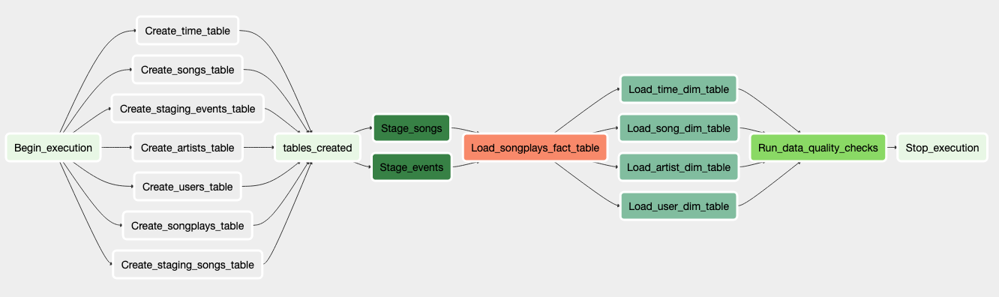

# Data lakes with Spark

## Introduction

A music streaming company, Sparkify, has decided that it is time to introduce more automation and monitoring to their
data warehouse ETL pipelines and come to the conclusion that the best tool to achieve this is Apache Airflow.

The source data resides in S3 and needs to be processed in Sparkify's data warehouse in Amazon Redshift. The source
datasets consist of JSON logs that tell about user activity in the application and JSON metadata about the songs the
users listen to.

- ```LOG_DATA```: s3a://udacity-dend/log_data
- ```SONG_DATA```: s3a://udacity-dend/song_data

The main goal of the project is to create high grade data pipelines that are dynamic and built from reusable tasks, can
be monitored, and allow easy back-fills. They have also noted that the data quality plays a big part when analyses are
executed on top the data warehouse and want to run tests against their datasets after the ETL steps have been executed
to catch any discrepancies in the datasets.

****

## Data Sources

There are two JSON sources to retrieve the data from.

**song_data**: JSON files containing song metadata. A sample entry in the JSON file is:

```JSON
{
  "num_songs": 1,
  "artist_id": "ARJIE2Y1187B994AB7",
  "artist_latitude": null,
  "artist_longitude": null,
  "artist_location": "",
  "artist_name": "Line Renaud",
  "song_id": "SOUPIRU12A6D4FA1E1",
  "title": "Der Kleine Dompfaff",
  "duration": 152.92036,
  "year": 0
}

```

**log_data**: JSON files containing song metadata. A sample entry in the JSON file is:

```JSON
{
  "artist": "Sydney Youngblood",
  "auth": "Logged In",
  "firstName": "Jacob",
  "gender": "M",
  "itemInSession": 53,
  "lastName": "Klein",
  "length": 238.07955,
  "level": "paid",
  "location": "Tampa-St. Petersburg-Clearwater, FL",
  "method": "PUT",
  "page": "NextSong",
  "registration": 1.540558e+12,
  "sessionId": 954,
  "song": "Ain't No Sunshine",
  "status": 200,
  "ts": 1543449657796,
  "userAgent": "Mozilla/5.0 (Macintosh; Intel Mac OS X 10_9_4)",
  "userId": 73
}
```

## Data Schema

### Fact Table

- **songplays** (songplay_id, start_time, user_id, level, song_id, artist_id, session_id, location, user_agent)

### Dimension Tables

- **users**: (user_id, first_name, last_name, gender, leve)
- **songs**: (song_id, title, artist_id, year, duration)
- **artists**: ( artist_id, name, location, lattitude, longitud)
- **time**: (start_time, hour, day, week, month, year, weekday)

### Airflow DAG

The following is the diagram of the DAG to be run by the data pipeline



* The `Begin execution` task marks the beginning of the ETL.
* The `Create staging events table` task creates the `staging events` table on Redshift.
* The `Create staging songs table` task creates the `staging songs` table on Redshift.
* The `Create songplays table` task creates the `songplays` fact table on Redshift.
* The `Create artists table` task creates the `artists` dimension table on Redshift.
* The `Create songs table` task creates the `songs` dimension table on Redshift.
* The `Create users table` task creates the `users` dimension table on Redshift.
* The `Create time table` task creates the `time` dimension table on Redshift.
* The `Tables created` task indicates that all tables are created on Redshift.
* The `Stage events` task loads user activity logs from S3 into the staging table.
* The `Stage songs` task loads songs metadata from S3 into a staging table.
* The `Load songplays fact table` task loads data from the staging tables into the songplay fact table.
* The `Load artists dim table` task loads data from the staging tables into the artists dimension table.
* The `Load songs dim table` task loads data from the staging tables into the songs dimension table.
* The `Load users dim table` task loads data from the staging tables into the users dimension table.
* The `Load time dim table` task loads data from the staging tables into the time dimension table.
* The `Run data quality checks` task checks the data quality of the tables.
* The `Stop execution` task indicates that the ETL is completed.

## Running the Pipeline

1. Create an AWS Redshift instance.

    * Attach AmazonS3ReadOnlyAccess access to the IAM role for the cluster
    * Change publicly accessible setting in Redshift cluster to “Yes”
    * Add inbound rules for TCP inbound connection either from 0.0.0.0 (insecure) or from the IP address of your machine
      or the server running Airflow.

2. In Airflow's UI, configure your AWS credentials
    * Conn Id: Enter aws_default.
    * Login: Access key ID.
    * Password: Secret access key.


3. In Airflow's UI, configure your Redshift credentials
    * Conn Id: postgres_default.
    * Host: Enter the endpoint of your Redshift cluster, **excluding the port at the end**.
    * Schema: Enter dev.
    * Login: Enter awsuser.
    * Password: Enter the password you created when launching your Redshift cluster.
    * Port: Enter 5439.