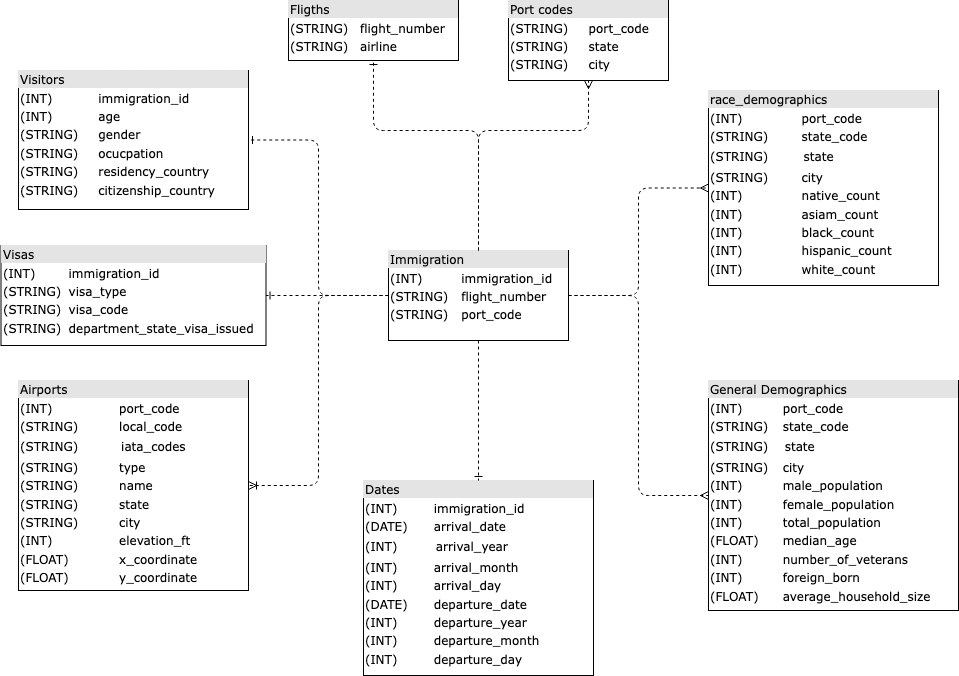
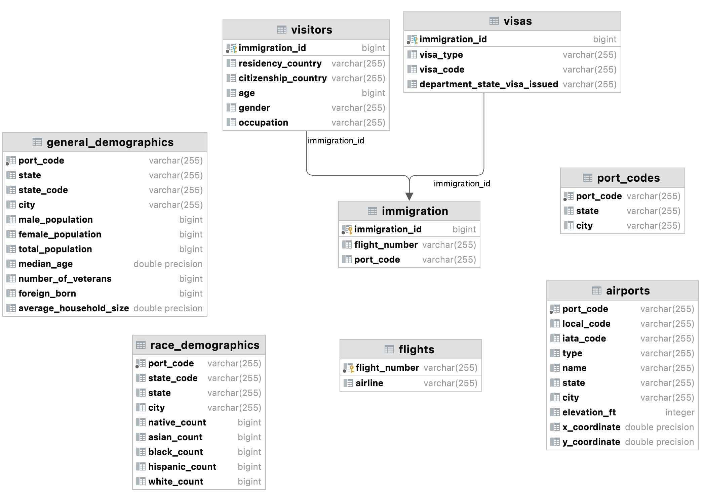
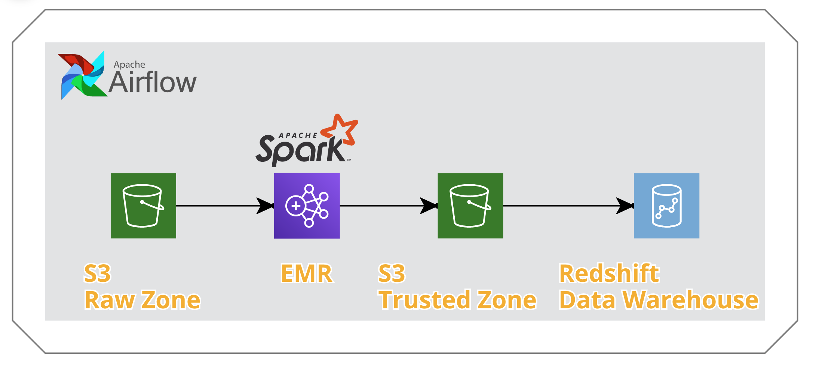

# Data engineering Capstone project

## Introduction

US Immigration data is highly valuable for policy definitions. The data can help identify patterns about the most
important features of travelers visiting the US. This information will enable government and private organizations to
improve their knowledge and strategies regarding immigration.

This project build and runs an end-to-end ETL pipeline from S3 to Redshift with the 2016 I94 Immigration Data, along
with other datasets from airports and US cities, to prepare a star-schema database model intended for analytical
purposes. It extracts data from S3, creates the data model in Spark, loads the data back to S3 in parquet format and
finally, using Redshift Spectrum loads the date into Redshift tables for easy analytical querying.

### Possible analytical questions

1. Where did the majority of travelers that came to the US in 2016 reside?
2. The distribution of travellers by state and municipality?
3. Which US municipality received the most and least travellers?
4. Which months have the highest volume of travellers?
5. What are the demographic characteristics of the cities with the highest volume of travellers?
6. Which is the most popular airline amongst 2016 traveller?
7. The average duration of the traveller's stays by day, month or quarter?
8. The average age of the travellers?

## Data Sources

### I94 Immigration Data

This data comes from the US
National [Tourism and Trade Office](https://www.trade.gov/national-travel-and-tourism-office)
.

### U.S. City Demographic Data

This data comes from [OpenSoft](https://www.trade.gov/national-travel-and-tourism-office). You can read more about it
here.

### Airport Code data

This is a simple table of airport codes and corresponding cities. It comes
from [here](https://datahub.io/core/airport-codes#data).

### Port codes data

This data is constructed from the data dictionary of the I-94 immigration data. The code to construct the dataset can be
found in the `EDA` notebook.

## Data Schema

### Fact Table

### Fact Table

`immigration`

- immigration_id: The unique ID for the respondent's immigration record. Primary key for this table. Foreign key
  for `visitors`, `visas` and `dates` tables.
- flight_number: The flight number of the respondent. Foreign key for `flights` table.
- port_code: The US port of arrival code of the respondent. Foreign key for `general_demographics`
  , `race_demographics`, `airports` and `port_codes` tables

### Dimension Tables



`flights`

- flight_number: The flight number of the respondent. Primary key for this table.
- airline: The airline taken by the respondent.

`visitors`

- immigration_id: The unique ID for the respondent's immigration record. Primary key for this table.
- age: The age of the respondent.
- gender: the gender of the respondent.
- occupation: The respondent's occupation.
- residency_country: The respondent's country of residence.
- citizenship_country: The respondent's country of citizenship.

`dates`

- immigration_id: The unique ID for the respondent's immigration record. Primary key for this table.
- arrival_date: Respondent's arrival date to the US.
- arrival_year: Year of arrival.
- arrival_month: Month of arrival.
- arrival_day: day of arrival.
- departure_date: Respondents departure_date from the US.
- departure_year: Year of departure
- departure_month: month of departure
- departure_day: Day of departure

`visas`

- immigration_id: The unique ID for the respondent's immigration record. Primary key for this table.
- visa_type: The respondent's visa class.
- visa_code: The respondent's generic visa class (student, pleasure, business).
- department_state_visa_issued: The state where the visa is issued to the respondent.

`general_demographics`

- port_code: The US port of arrival code for the city. Primary key for this table.
- state_code: The state code.
- state: The state of the US city.
- city: The name of the US city
- male_population: The male population of the US city.
- female_population: The female population of the US city.
- total_population: The total population of the US city.
- median_age: The median age of the US cities.
- number_of_veterans: The number of US veterans in the US city.
- foreign_born: The number of foreign born in the US city.
- average_household_size: The average household size in the US city.

`race_demographics`

- port_code: The US port of arrival code for the city. Primary key for this table.
- state_code: The state code.
- state: The state of the US city.
- city: The name of the US city
- native_count: Number of native americans.
- asian_count: Number of asians.
- black_count: Number of blacks.
- hispanic_count:  number of hispanics.
- white_count: number of whites.

`airports`

- port_code: The US port of arrival code for the city. Primary key for this table.
- local_code: Local airport code.
- iata_code: Iata international airport code.
- type: Airport Type.
- name: Airport Name.
- state_code: Airport state code.
- city: City which the airport belongs to.
- x_coordinates: x gps coordinate.
- y_coordinate: y gps coordinate.
- elevation_ft: Airport elevation.

`port_codes`

- port_code: The US port of arrival code for the city. Primary key for this table.
- state_code: Sate code.
- city: City or municipality name.




### Data dictionary

**Immigration**

| **Item**  | **Type** | **Description** |
|--------------|-----------|------------|
| immigration_id | **INT** | Primary key. Foreign key for `visitors`, `visas` and `dates` dimension tables.|
| flight_number | **STRING** | The flight number. Foreign key for `flights` dimension table.|
| port_code | **STRING** | The US port of arrival. Foreign key for `general_demographics` , `race_demographics`, `airports` and `port_codes` dimension tables.|

**Visitors**

| **Item**     | **Type**   | **Description** |
|--------------|-----------|------------|
|immigration_id|**INT**|Primary key. Foreign key to `immigration` fact table.|
|age|**INT**| Age of the respondent.|
|gender|**STRING**| Gender of the respondent.|
|occupation|**STRING**| Occupation of the respondent.|
|residency_country|**STRING**| Country of residence of the respondent.| 
|citizenship_country|**STRING**| Country of citizenship of the respondent.|

**Dates**

| **Item**     | **Type**   | **Description** |
|--------------|-----------|------------|
|immigration_id|**INT**|Primary key. Foreign key to `immigration` fact table.|
|arrival_date|**DATE**|Date of arrival to the US.|
|arrival_year|**INT**|Year of arrival to the US.|
|arrival_month|**INT**|Month of arrival to the US.|
|arrival_day|**INT**|Day of arrival to the US.| 
|departure_date|**DATE**|Date of departure from the US.|
|departure_yea|**INT**|Year of departure from the US.|
|departure_mon|**INT**|Month of arrival to the US.|
|departure_day|**INT**|Day of departure from the US.|

**Visas**

| **Item**     | **Type**   | **Description** |
|--------------|-----------|------------|
|immigration_id|**INT**|Primary key. Foreign key to `immigration` fact table.|
|visa_type|**STRING**|Visa type of the respondent.|
|visa_code|**STRING**|Visa code of the respondent.|
|department_state_visa_issued|**STRING**|State department that issued the respondent's visa.|

**General Demographics**

| **Item**     | **Type**   | **Description** |
|--------------|-----------|------------|
|port_code|**STRING**|Port of arrival to the US. Foreign key to the `immigration` fact table.|
|state_code|**STRING**|Three letter state code.|
|state|**STRING**|State name.|
|city|**STRING**|City or municipality name.|
|male_population|**INT**|Male population of the municipality.|
|female_population|**INT**|Female population of the municipality.|
|total_population|**INT**|Total population of the municipality.|
|median_age|**FLOAT**|Median age of the municipality.|
|number_of_veterans|**INT**|Veteran number in the municipality.|
|foreign_born|**INT**|Number of people born outside the US in the municipality.|
|average_household_size|**FLOAT**|Average number of people in a household in the municipality.|

**General Demographics**

| **Item**     | **Type**   | **Description** |
|--------------|-----------|------------|
|port_code|**STRING**|Port of arrival to the US. Foreign key to the `immigration` fact table.|
|state_code|**STRING**|Three letter state code.|
|state|**STRING**|State name.|
|city|**STRING**|City or municipality name.|
|native_count|**INT**|Number of native americans in the municipality|
|asian_count|**INT**|Number of asians in the municipality|
|black_count|**INT**|Number of blacks in the municipality|
|hispanic_count|**INT**|Number of hispanics in the municipality|
|white_count|**INT**|Number of whites in the municipality|

**Airports**

| **Item**     | **Type**   | **Description** |
|--------------|-----------|------------|
|port_code|**STRING**|Port of arrival to the US. Foreign key to the `immigration` fact table.|
|local_code|**STRING**|Local code for the airport in the US.|
|iata_code|**STRING**|IATA code for the airport.|
|type|**STRING**|Airport Type.|
|name|**STRING**|Airport name.|
|state_code|**STRING**|Three letter state code.|
|city|**STRING**|City or municipality name.|
|elevation_ft|**INT**|Elevation in feet of the airport.|
|x_coordinate|**FLOAT**|X gps coordinate of the airport.|
|y_coordinate|**FLOAT**|Y gps coordinate of the airport.| 

**Port codes**

| **Item**     | **Type**   | **Description** |
|--------------|-----------|------------|
|port_code|**STRING**|Port of arrival to the US. Foreign key to the `immigration` fact table.|
|state_code|**STRING**|Three letter state code.|
|city|**STRING**|City or municipality name.|

## Airflow DAG

The following is the diagram of the DAG to be run by the data pipeline


## Running the Pipeline



1. Create a bucket and upload the raw data into the `raw/` directory.

2. Upload the Spark and spark ´cfg´ file to the `src` directory in the bucket. The config file should follow the
   following format
   ```config
   [TEST]
   TEST=<0 or 1 for local testing>

    [AWS]
    AWS_ACCESS_KEY_ID=<aws key id>
    AWS_SECRET_ACCESS_KEY=<aws secret key>
    DESTINATION_BUCKET=<bucket name>
   ```

3. Create an AWS Redshift instance.

    - Attach AmazonS3ReadOnlyAccess access to the IAM role for the cluster
    - Make the Redshift cluster publicly accessible
    - Add inbound rules for TCP inbound connection either from 0.0.0.0 (insecure) or from the IP address of your machine
      or the server running Airflow.

4. To run airflow locally run the following command in the `airflow` directory
   ```bash
   docker compose  up -d 
   ```
5. In Airflow's UI, configure your AWS credentials
    - Conn Id: Enter aws_default.
    - Login: Access key ID.
    - Password: Secret access key.


6. In Airflow's UI, configure your Redshift credentials
    * Conn Id: postgres_default.
    * Host: Enter the endpoint of your Redshift cluster, **excluding the port at the end**.
    * Schema: dev.
    * Login: awsuser.
    * Password: Enter the password you created when launching your Redshift cluster.
    * Port: Enter 5439.

## Example queries

Here are some examples of analytical queries that can be made using the defined data model.

 ```sql
 SELECT COUNT(*) AS TRAVELER_NUMBER,
        AIRLINE
 FROM IMMIGRATION I
          JOIN FLIGHTS F ON I.FLIGHT_NUMBER = F.FLIGHT_NUMBER
 WHERE AIRLINE IS NOT NULL
 GROUP BY F.AIRLINE
 ORDER BY 1 DESC
 LIMIT 5
 ```

| total_travelers | airline |
| :--- | :--- |
| 305640 | UA |
| 261484 | AA |
| 234987 | DL |
| 136178 | BA |
| 80553 | JL |

```sql
SELECT DISTINCT DEPARTURE_DATE,
                ARRIVAL_DATE,
                DATEDIFF(DAY, ARRIVAL_DATE, DEPARTURE_DATE) AS STAY_DARATION
FROM DATES
WHERE DEPARTURE_DATE IS NOT NULL
  AND DATE_PART(YEAR, DEPARTURE_DATE) < 2020
ORDER BY 3 DESC
LIMIT 10
```

| departure\_date | arrival\_date | stay\_daration |
| :--- | :--- | :--- |
| 2016-09-19 | 2016-04-01 | 171 |
| 2016-09-18 | 2016-04-01 | 170 |
| 2016-09-19 | 2016-04-02 | 170 |
| 2016-09-17 | 2016-04-01 | 169 |
| 2016-09-18 | 2016-04-02 | 169 |
| 2016-09-19 | 2016-04-03 | 169 |
| 2016-09-18 | 2016-04-03 | 168 |
| 2016-09-19 | 2016-04-04 | 168 |
| 2016-09-17 | 2016-04-02 | 168 |
| 2016-09-16 | 2016-04-01 | 168 |

```sql
SELECT FLIGHT_NUMBER,
       RESIDENCY_COUNTRY,
       CITIZENSHIP_COUNTRY,
       AGE,
       GENDER
FROM IMMIGRATION I
         JOIN DATES D ON I.IMMIGRATION_ID = D.IMMIGRATION_ID
         JOIN VISITORS V ON I.IMMIGRATION_ID = V.IMMIGRATION_ID
WHERE D.ARRIVAL_MONTH = 4
LIMIT 10
```

| flight\_number | residency\_country | citizenship\_country | age | gender |
| :--- | :--- | :--- | :--- | :--- |
| 03348 | ALBANIA | ALBANIA | 33 | NULL |
| 00033 | ALBANIA | ALBANIA | 53 | F |
| 1 | ALBANIA | ALBANIA | 74 | F |
| 00608 | ALBANIA | ALBANIA | 33 | M |
| 00077 | ALBANIA | ALBANIA | 65 | F |
| 07450 | GERMANY | ALBANIA | 54 | M |
| 00063 | ISRAEL | ALBANIA | 42 | F |
| 00444 | AUSTRIA | AUSTRIA | 55 | M |
| 00444 | AUSTRIA | AUSTRIA | 55 | NULL |
| 00422 | AUSTRIA | AUSTRIA | 52 | NULL |

## Rationale behind choosing the tech stack

- S3: cheap, scalable and simple cloud object storage to build the data lake into.
- Redshift: Great distributed data-warehouse solution managed by AWS. Simple maintainability and great scaling
  capabilities.
- Apache Spark & EMR: Distributed data processing framework for handling large volumes of data. EMR is a simple Hadoop
  and Spark manged cluster provider to run processing workloads at scale.
- Apache Airflow: Open source very powerful data orchestration and monitoring framework to build reproducible and
  reliable data pipelines.

## How often should the data be updated?

The update frequency of the data will depend on two factors, first the frequency in which the I-94 data is updated by
the National Tourism and Trade Office in their webpage. And secondly how frequently do the business partners running
analytics workloads with the data. The first scenario is an external limiting factor which is a hard requirement on the
schedule in which the pipeline should run, i.e. it makes no sense running the pipeline with a higher frequency than the
data update form the source. The second scenario is an internal design decision that can be modified according to the
data needs, thus if analyses are to be run daily or weekly would mean that the data pipeline schedule should easily
accommodate this design decisions.

## Addressing Other Scenarios

### 1. If the data was increased by 100x.

The ETL pipeline is currently run in an AWS EMR cluster. If the data increases 100x, we simply need to increase the
number of EMR cluster nodes used to execute the pipeline. Redshift has very good scalability capabilities since it can
add more nodes to handle the load of 100 times more data easily.

### 2. If the pipelines were run on a daily basis by 7am.

Scheduling the pipeline in Airflow to run daily at 7 am is a trivial modification to the code.

### 3. If the database needed to be accessed by 100+ people.

Clean data was loaded into a Redshift cluster, which has easy scalability capabilities. Therefore, adding more nodes to
the cluster would easily solve the increase access demand. 