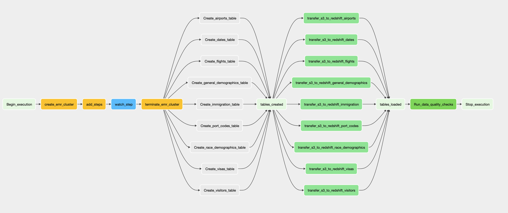

# Data engineering Capstone project

## Introduction

This project runs an end-to-end ETL pipeline from S3 to Redshift. It extracts data from S3, creates the data model in
Spark, loads the data back to S3 in parquet format and the using Redshift Spectrum loads the date into Redshift tables
for easy querying.

## Data Sources

### I94 Immigration Data

This data comes from the US
National [Tourism and Trade Office](https://www.trade.gov/national-travel-and-tourism-office)
.

### U.S. City Demographic Data

This data comes from [OpenSoft](https://www.trade.gov/national-travel-and-tourism-office). You can read more about it
here.

### Airport Code data

This is a simple table of airport codes and corresponding cities. It comes
from [here](https://datahub.io/core/airport-codes#data).

### Port codes data

This data is constructed from the data dictionary of the I-94 immigration data. The code to construct the dataset can
be found in the `EDA` notebook.

## Data Schema

### Fact Table

### 1. Fact Table

`immigration`

- immigration_id: The unique ID for the respondent's immigration record. Primary key for this table. Foreign key
  for `visitors`, `visas` and `dates` tables.
- flight_number: The flight number of the respondent. Foreign key for `flight` table.
- port_code: The US port of arrival code of the respondent. Foreign key for `general_demographics`
  , `racial_demographics`, `airports` and `port_codes` tables

### 2. Dimension Tables

`flights`

- flight_number: The flight number of the respondent. Primary key for this table.
- airline: The airline taken by the respondent.

`visitors`

- immigration_id: The unique ID for the respondent's immigration record. Primary key for this table.
- age: The age of the respondent.
- gender: the gender of the respondent.
- occupation: The respondent's occupation.
- residency_country: The respondent's country of residence.
- citizenship_country: The respondent's country of citizenship.

`dates`

- immigration_id: The unique ID for the respondent's immigration record. Primary key for this table.
- arrival_date: Respondent's arrival date to the US.
- arrival_year: Year of arrival.
- arrival_month: Month of arrival.
- arrival_day: day of arrival.
- departure_date: Respondents departure_date from the US.
- departure_year: Year of departure
- departure_month: month of departure
- departure_day: Day of departure

`visas`

- immigration_id: The unique ID for the respondent's immigration record. Primary key for this table.
- visa_type: The respondent's visa class.
- visa_code: The respondent's generic visa class (student, pleasure, business).
- department_state_visa_issued: The state where the visa is issued to the respondent.

`general_demographics`

- port_code: The US port of arrival code for the city. Primary key for this table.
- city: The name of the US city
- state: The state of the US city.
- state_code: The state code.
- median_age: The median age of the US cities.
- male_population: The male population of the US city.
- female_population: The female population of the US city.
- total_population: The total population of the US city.
- number_of_veterans: The number of US veterans in the US city.
- foreign-born: The number of foreignborn in the US city.
- average_household_size: The average household size in the US city.

`race_demographics`

- port_code: The US port of arrival code for the city. Primary key for this table.
- city: The name of the US city
- state: The state of the US city.
- state_code: The state code.
- native_count: Number of native americans.
- asian_count: Number of asians.
- black_count: Number of blacks.
- hispanic_count:  number of hispanics.
- white_count: number of whites.

`airports`

- port_code: The US port of arrival code for the city. Primary key for this table.
- local_code: Local aiport code.
- iata_code: Iata internatinal aiport code.
- type: Airport Type.
- name: Aitport Name.
- state_code: Airport state code.
- city: City which the airport belongs to.
- coordinates: Airport gps coordinates.
- elevation_ft: Airport elevation.

`port_codes`

- port_code: The US port of arrival code for the city. Primary key for this table.
- state_code: Sate code.
- city: City or municipality name.

### Airflow DAG

The following is the diagram of the DAG to be run by the data pipeline



## Running the Pipeline

1. Create a bucket and upload the raw data into the `raw/` directory.

2. Upload the Spark and spark ´cfg´ file to the `src` directory in the bucket. The config file should follow the
   following format
   ```config
   [TEST]
   TEST=<0 or 1 for local testing>

    [AWS]
    AWS_ACCESS_KEY_ID=<aws key id>
    AWS_SECRET_ACCESS_KEY=<aws secret key>
    DESTINATION_BUCKET=<bucket name>
   ```

3. Create an AWS Redshift instance.

    - Attach AmazonS3ReadOnlyAccess access to the IAM role for the cluster
    - Make the Redshift cluster publicly accessible
    - Add inbound rules for TCP inbound connection either from 0.0.0.0 (insecure) or from the IP address of your machine
      or the server running Airflow.

4. To run airflow locally run the following command in the `airflow` directory
   ```bash
   docker compose  up -d 
   ```
5. In Airflow's UI, configure your AWS credentials
    - Conn Id: Enter aws_default.
    - Login: Access key ID.
    - Password: Secret access key.


6. In Airflow's UI, configure your Redshift credentials
    * Conn Id: postgres_default.
    * Host: Enter the endpoint of your Redshift cluster, **excluding the port at the end**.
    * Schema: dev.
    * Login: awsuser.
    * Password: Enter the password you created when launching your Redshift cluster.
    * Port: Enter 5439.

## Addressing Other Scenarios

### 1. If the data was increased by 100x.

The ETL pipeline is currently run in an AWS EMR cluster. If the data increases 100x, we simply need to increase the
number of EMR cluster nodes used to execute the pipeline. Redshift has very good scalability capabilities since it can
add more nodes to handle the load of 100 times more data easily.

### 2. If the pipelines were run on a daily basis by 7am.

Scheduling the pipeline in Airflow to run daily at 7 am is a trivial modification to the code.

### 3. If the database needed to be accessed by 100+ people.

Clean data was loaded into a Redshift cluster, which has easy scalability capabilities. Therefore, adding more nodes to
the cluster would easily solve the increase access demand. 